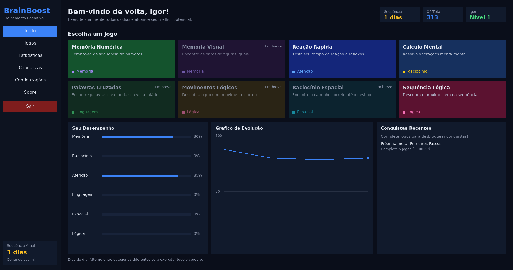

# BrainBoost — Treinamento Cognitivo


Aplicativo desktop de treinamento cerebral escrito em **C++17**, com interface
gráfica **100% própria** (nenhuma biblioteca de UI de terceiros no repositório):
o desenho é feito direto com **SDL2** e o texto é renderizado com **FreeType**,
ambas bibliotecas do sistema.

## Dependências

Todas de sistema:

- `cmake` (3.16+) e `g++` (ou outro compilador C++17)
- SDL2 (pacote de desenvolvimento, ex.: `SDL2-devel` / `libsdl2-dev`)
- FreeType (pacote de desenvolvimento, ex.: `freetype-devel` / `libfreetype-dev`)
- Fonte DejaVu Sans instalada (presente por padrão nas principais distribuições)

**Plataformas suportadas:** Linux. O código de persistência é multiplataforma
(SDL2 + `std::filesystem`), mas o carregamento de fontes procura a DejaVu Sans
em caminhos de sistemas Linux, então outras plataformas exigiriam ajustes em
`src/ui/Renderer.cpp`.

## Como compilar e executar

```sh
cmake -B build
cmake --build build -j$(nproc)
./scripts/run.sh
```

> **Nota (Flatpak/VSCode):** prefira `./scripts/run.sh` a chamar o binário
> direto. O terminal do VSCode Flatpak injeta bibliotecas do host via
> `LD_LIBRARY_PATH` e isso pode atrapalhar a criação da janela; o script
> remove a variável antes de executar. (Há também um fallback para
> renderização por software.) Chamar `./build/brainboost` diretamente também
> funciona fora desse ambiente.

## Como executar os testes

Os testes são compilados junto com o projeto e executados via CTest:

```sh
cmake -B build
cmake --build build -j$(nproc)
ctest --test-dir build --output-on-failure
```

Os testes usam apenas diretórios temporários do sistema — nunca tocam no
progresso real do usuário.

## Funcionalidades

- **Dashboard** com cards de jogos, indicadores de XP, nível e sequência de dias,
  barras de desempenho por categoria e gráfico de evolução das sessões.
- **4 jogos jogáveis**: Memória Numérica, Cálculo Mental, Sequência Lógica e
  Reação Rápida (os demais cards aparecem como "Em breve").
- **Progressão**: XP, níveis (500 XP por nível) e sequência diária (streak).
- **Conquistas** desbloqueáveis com recompensa em XP — cada recompensa é
  concedida no máximo uma vez por progresso, mesmo depois de redefinições
  parciais.
- **Salvamento local automático** ao fim de cada jogo e ao fechar o app.

## Onde o progresso é salvo

O progresso fica em um diretório **estável e específico do usuário**, obtido
via `SDL_GetPrefPath()` — ele não depende do diretório em que o programa foi
iniciado:

- Linux: `~/.local/share/BrainBoost/BrainBoost/brainboost_save.ini`
- Dentro de um Flatpak (ex.: VSCode):
  `~/.var/app/<id-do-flatpak>/data/BrainBoost/BrainBoost/brainboost_save.ini`

No mesmo diretório vivem os arquivos auxiliares, todos derivados do principal
(resolução centralizada em `core/SavePaths`):

| Arquivo | Papel |
| --- | --- |
| `brainboost_save.ini` | progresso principal (formato texto `chave=valor`, versionado) |
| `brainboost_save.ini.bak` | backup criado a cada salvamento válido |
| `brainboost_save.ini.tmp` | escrita atômica (gravado e depois renomeado) |
| `brainboost_save.ini.corrupted[.N]` | quarentena de arquivos corrompidos |

### Validação, backup e quarentena

Ao carregar, o arquivo passa por validação estrutural: versão obrigatória e
campos obrigatórios presentes e dentro do formato. Arquivos vazios, truncados,
só com comentários ou só com a versão são tratados como **corrompidos** — o
arquivo é movido para quarentena (`.corrupted`) para diagnóstico e, se existir
um backup válido, ele é validado e restaurado como arquivo principal
automaticamente. Um arquivo criado por uma versão mais nova do BrainBoost é
aberto em modo somente leitura e nunca é sobrescrito.

### Migração do caminho antigo

Versões antigas salvavam em `save/brainboost_save.ini`, relativo ao diretório
de execução. Na primeira inicialização, o app migra automaticamente esse
arquivo (e o backup, se válido) para o novo diretório:

1. Se já existir progresso no novo local, nada é sobrescrito.
2. O arquivo antigo é validado antes de ser copiado; se estiver corrompido,
   o backup antigo válido é usado no lugar.
3. Só depois de confirmar que a cópia migrada é válida, os arquivos antigos
   são renomeados para `*.migrated` (preservados, nunca apagados).

## Estrutura do projeto

Headers ficam em `include/` e implementações em `src/`, espelhando as mesmas
subpastas:

```
include/            # todos os .h
├── app/            # Application (janela+loop), AppContext (estado compartilhado)
├── core/           # regras de negócio, sem nenhum código de UI
│   ├── GameCategory.h   # categorias cognitivas
│   ├── GameInfo.h       # metadados + factory de cada jogo
│   ├── GameRegistry.h   # catálogo de jogos (ponto único de registro)
│   ├── GameResult.h     # resultado de uma sessão
│   ├── UserProfile.h    # nome, XP, nível, streak, conquistas e recompensas
│   ├── Statistics.h     # habilidade por categoria + histórico
│   ├── Achievements.h   # definições e condições de desbloqueio
│   ├── SaveManager.h    # persistência chave=valor com validação e backup
│   └── SavePaths.h      # resolução do diretório estável + migração do caminho antigo
├── games/          # interface Game + um header por jogo
└── ui/             # interface gráfica própria
    ├── Theme.h          # struct Color + paleta central
    ├── Rect.h           # retângulo (layout e hit-test)
    ├── Renderer.h       # desenho 2D + texto TTF via FreeType (cache de glifos)
    ├── Input.h          # snapshot de mouse/teclado por frame
    ├── Widgets.h        # botão, card, barras, chip, gráfico, campo de texto
    ├── ScreenId.h       # enum das páginas
    └── *Screen.h        # Sidebar, Home, Game, Stats, Achievements, Settings, About

src/                # todos os .cpp (mesma organização)
└── main.cpp        # ponto de entrada

test/               # testes (framework próprio TEST_CHECK, integrados ao CTest)
```

**Fluxo de dados:** as telas recebem `AppContext&` (dados) + `Renderer&`/
`Input&` (UI) e nunca tocam SDL diretamente; a camada `core` não conhece nada
de interface. Cores vivem apenas em `Theme.h`.

## Como adicionar um novo jogo

1. Crie `include/games/MeuJogo.h` e `src/games/MeuJogo.cpp` implementando a
   interface `Game` (`update()`, `render()`, `isFinished()`, `result()`) —
   use um jogo existente como modelo. `update()` cuida apenas de regras e
   ações semânticas; `render()` cuida de geometria e desenho.
2. Registre-o em `src/core/GameRegistry.cpp` com título, descrição, categoria,
   cor do card e `makeFactory<MeuJogo>()`.
3. Adicione o `.cpp` ao `CMakeLists.txt`.

Cards, XP, estatísticas, gráfico e conquistas passam a considerá-lo
automaticamente.
